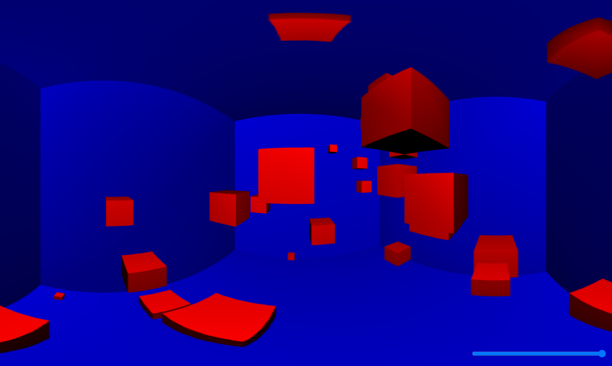

# XTREME Fisheye
Implementation of a true fisheye projection in ThreeJS

I recently saw a short video of the cancelled Sega Saturn game [Sonic Xtreme](https://en.wikipedia.org/wiki/Sonic_X-treme) and wanted to try movement in a 3D environment using a fisheye camera. Most fisheye cameras that you can find on the web apply the transformation in postprocessing to a flat texture. This introduces heavy distortion at the edges of the image, and sight lines into the scene do not curve properly. In contrast, this project places a CubeCamera on the player, and uses the EffectComposer to sample from the cubemap in order to render the scene.

This technique was first described by Wouter van Oortmerssen, who used it to make [Fisheye Quake](https://strlen.com/gfxengine/fisheyequake/). Shaun LeBron has a thoroughly documented implementation called [Blinky](https://github.com/shaunlebron/blinky) that I used to fix my projection math.

## How to build and run

* Install with `yarn`
* Due to a [bug in Snowpack](https://github.com/FredKSchott/snowpack/issues/3867), you need to add this line to Three's exports list in package.json: `"./examples/jsm/postprocessing/*": "./examples/jsm/postprocessing/*",`
* Build with `yarn build`
* Run an interactive Snowpack server with `yarn start`. Snowpack should open a tab at `http://localhost:8080` that runs the app.

Controls are AD to rotate, WS to go forward and back, and QZ to go up and down.